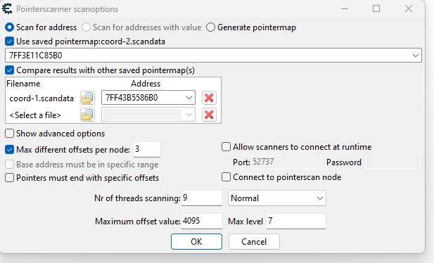
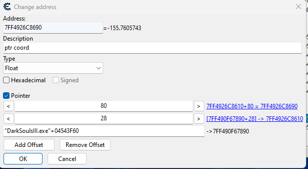

+++
author = "t0muxx"
categories = ["Game Hacking", "Windows"]
date = "2024-03-10T00:00:00Z"
tags =  ["Game Hacking", "Windows"]
title = "Creating a basic fly hack for Dark Souls 3"
+++

I always have been interesting about game hacking, not because I'm a lame gamer with no skills (am I ?) but because it is  a fun way to learn new technical skills. So after beating Dark Souls III, I started to work on a so-called "fly hack" for it.

<!--more-->

## Disclaimer

The content provided in this blog post is intended for educational and informational purposes only. The techniques, methods, and information discussed herein are solely for understanding and studying the mechanics of game systems and should not be used for any illegal or unethical activities, including but not limited to cheating, hacking, or exploiting games for unfair advantage.

Engaging in game hacking, cheating, or any form of unauthorized manipulation of game software is a violation of the terms of service of most gaming platforms and may lead to severe consequences, including but not limited to bans, legal actions, and damage to one's reputation.

## Summary

The ideas behind this fly hack is fairly simple. 
It will modify the player coordinates directly from the game memory. The memory addresses for the player character will be found using Cheat Engine, and a dll modifying the memory will be injected into the target process.
## Finding character coordinates

To retrieve the coordinates in memory, I will use [CheatEngine](https://www.cheatengine.org/).  [CheatEngine](https://www.cheatengine.org/) is a powerful memory scanning tools, that will allow to found the player character coordinates in the process memory.

I will not go into too much details about the usage of Cheat Engine because there is a lot of resources already available online.
### Finding Y coordinates

The first coordinates I was searching for was the `Y` coordinates. To found it, the first thing I did was to search for a ladder in game. Why a ladder ? Because this is an easy way to increase and decrease `Y` coordinate value thus simplifying the memory scanning using  the `increase value scan` and `decrease value scan` from Cheat Engine.

So the "fun" begun : 
- First scan -> `Unknown initial value`.
- Climb one step -> `Increase value` scan.
- Down one step -> `Decrease value` scan.
- No move -> `Unchanged value` scan.
- etc...

(Mapping scan triggers to CheatEngine hotkeys helps a lot during the process.)

Once having approx 500 memory addresses, I started to try to modify their value and see the result in game. To do that, I simply added them into the Cheat Engine addresses list, selected  half of the addresses -> pressed `Enter` (to modify their value) -> wrote `+1` -> checked if the character was going up in the game. 

Depending on the result I was deleting the selected/unselected addresses and starting again until I found the correct address.

There is probably better method for that, but this method did the job.


### Finding X and Z

Next step was to found the `X` and `Z` coordinates. Developers are not stupid, and tend to be organized, that's why usually coordinates are next to each others in memory.
I inspected the memory around the `Y` address by doing `ctrl+b`. I opened the memory view (Don't forget to right click -> display as -> float), and observed that the coordinates was next to each other (check offset 0x20, 0x24, 0x28 in the gif).


I represented the coordinates with this structure in my code :

```C
typedef struct s_coord {
  float x;
  float y;
  float z;
} t_coord;
```

After that, i still had an issue, the memory where the coordinates are, is "moving". Changing zone in the game, or even restarting the game made the coordinates moves. 

I needed to find some "stable" pointer that can be used.

### Cheat Engine's pointerscan

Cheat Engine's `pointerscan` I very useful in this case. This functionality will scan the memory to find "chain" of pointers that point to the wanted address. For that, I started by generating a first `pointermap` for the coordinates address (Right click -> generate pointermap).

After, I reloaded the game, thus making the address not valid anymore. I searched again to find the new coordinates structure address, and generated a `pointermap` for this new address. 

With that done, it was possible to do the pointer scan. I Right clicked on the new coordinate address, then clicked `pointerscan for this address`.  I used my saved pointermap and checked `Use saved Pointermap`.I also checked `Compare results with other savec pointermap(s)`. For the comparison, I selected the pointermap of the first coordinate address, and it's corresponding address.



I had several results. I just tried the first result with less offset (less chains of pointers) and found one that was working correctly. This pointer was located whiting the executable memory (probably data or bss).



At this moment, I had everything I need, and I started to code.

## Developing the fly hack

The code for the fly hack was easy to write.
The goal was simple :
- I wanted to see the console from my injected dll.
- I wanted to interpret keyboard key to modify the `x`,`y`,`z` values.

I will not cover how to inject a dll into a process.

### Opening console from injected dll

Opening the console from an injected dll is a known trick. I used the function `AllocConsole()` and then `freopen_s` to re-open `stdout`, `stdin`, `stderr` :

```cpp
int reopen_streams() {
  if (!AllocConsole()) {
    return (-1);
  }
  FILE *fDummy;
  freopen_s(&fDummy, "CONOUT$", "w", stdout);
  freopen_s(&fDummy, "CONOUT$", "w", stderr);
  freopen_s(&fDummy, "CONIN$", "r", stdin);
  std::cout.clear();
  std::clog.clear();
  std::cerr.clear();
  std::cin.clear();

  return (0);
}
```

### Retrieving process base address

To retrieve the base address of the game process, I relied on function `EnumProcesModules`. The first modules handle is always the loaded executable.

```cpp
uintptr_t get_exe_ba(HANDLE proc) {
  if (proc == (HANDLE)NULL) {
    return (NULL);
  }

  HMODULE modules[1024] = {0};
  DWORD bytes_needed = 0;

  if (!EnumProcessModules(proc, modules, sizeof(modules), &bytes_needed)) {
    errors::error_print("EnumProcessModules");
    return (NULL);
  }

  return (uintptr_t)modules[0];
}
```

### Retrieving coordonates in memory

At this time, I needed to define a structure pointing to the coordinates in memory to manipulate them. Easy to do, within the base address and the pointer found with CheatEngine. 

I decided to define a global structure :

```cpp
typedef struct s_coord {
  float x;
  float y;
  float z;
} t_coord;

t_coord *g_coord;
```

And then, with some simple dereferences in the code, I was able to set the structure pointer.

```cpp
// <?xml version="1.0" encoding="utf-8"?>
// <CheatTable>
//   <CheatEntries>
//     <CheatEntry>
//       <ID>1511</ID>
//       <Description>"ptr coord "</Description>
//       <VariableType>Float</VariableType>
//       <Address>"DarkSoulsIII.exe"+04543F60</Address>
//       <Offsets>
//         <Offset>80</Offset>
//         <Offset>28</Offset>
//       </Offsets>
//     </CheatEntry>
//   </CheatEntries>
// </CheatTable>

void set_coord() {
  printf("------------- coord ---------- \n");
  uintptr_t addr_0 = g_ba + 0x04543F60;
  printf("addr = %llx\n", (uintptr_t)addr_0);

  void **addr_1 = *(void **)addr_0;
  printf("addr_deref = %llx\n", (uintptr_t)addr_1);

  void *addr_2 = *(void **)((uintptr_t)(addr_1) + 0x28);
  printf("addr+0x28 = %llx\n", (uintptr_t)addr_2);

  g_coord = (t_coord *)((uintptr_t)(addr_2) + 0x80);
  printf("g_coord = %llx\n", (uintptr_t)g_coord);
}
```

The cast are important here, and (as always when playing with memory offset) I had some troubles with offsetting memory correctly.

### Keyboard input

To interpret the keyboard key event, I used `ReadConsoleInput`. I wanted the read to be non-blocking so I used `PeekConsoleEvent` to verify if an event was received before calling `ReadConsoleInput`. I did that, in a `While (TRUE)` loop and I implemented different actions depending on the received input key.


```cpp
while (TRUE) {
    g_coord->y = new_y;
    g_coord->z = new_z;
    g_coord->x = new_x;

    // Wait for the events.
    DWORD length = 0;
    if (PeekConsoleInput(hStdin, &inputrecord, 1, &length)) {
      if (length == 1) {
        if (!ReadConsoleInput(hStdin,     // input buffer handle
                              irInBuf,    // buffer to read into
                              128,        // size of read buffer
                              &cNumRead)) // number of records read
          errors::error_print("ReadConsoleInput");

        for (i = 0; i < cNumRead; i++) {
          switch (irInBuf[i].EventType) {
          case KEY_EVENT:
            process_key_event(irInBuf[i].Event.KeyEvent, &new_y, &new_z,
                              &new_x);
            break;

          case MOUSE_EVENT:

          case WINDOW_BUFFER_SIZE_EVENT:

          case FOCUS_EVENT:

          case MENU_EVENT:
            break;

          default:
            errors::error_print("Unknown event type");
            break;
          }
        }
      }
    }
  }
```

Nothing complicated here, `1`, `2`, `3`, `4`, `5`, `6` allows to modify `x`,`y`,`z` and `R` reset the structure coordinates address.
```cpp
VOID process_key_event(KEY_EVENT_RECORD ker, float *y, float *z, float *x) {

  if (ker.bKeyDown) {
    if (ker.wVirtualKeyCode == '1') {
      *y += 0.3;
    } else if (ker.wVirtualKeyCode == '2') {
      *y -= 0.3;
    }
    if (ker.wVirtualKeyCode == '3') {
      *z += 0.3;
    } else if (ker.wVirtualKeyCode == '4') {
      *z -= 0.3;
    }
    if (ker.wVirtualKeyCode == '5') {
      *x += 0.3;
    } else if (ker.wVirtualKeyCode == '6') {
      *x -= 0.3;
    } else if (ker.wVirtualKeyCode == 'R') {
      set_coord();

      *y = g_coord->y;
      *z = g_coord->z;
      *x = g_coord->x;
    }
  }
}
```

Everything was ready, and I compiled the Dll, injected it into the game process and Voila :


## Conclusion

Nothing fancy, or new here, but a quick and fun project. There is still a lot of issue with this fly hack, the main one is that the character is still taking collision damage. Another issue is that the focus needs to be on the console to input coordinates modifications.

In the next step, I think I will use Windows API Hooking to be able to intercept keyboard input directly in game, and create a "god mode" to not take any damage or dying from collision.

## Complete dll code 

```cpp
#include <windows.h>

#include <cstdint>
#include <cstdio>
#include <processthreadsapi.h>

#include <winuser.h>

#include "libfenetre/dll_injection.h"
#include "libfenetre/errors.h"
#include "libfenetre/process.h"

HANDLE hStdin;
DWORD fdwSaveOldMode;
uintptr_t g_ba;


typedef struct s_coord {
  float x;
  float y;
  float z;
} t_coord;

t_coord *g_coord;

void set_coord() {
  printf("------------- coord ---------- \n");
  uintptr_t addr_0 = g_ba + 0x04543F60;
  printf("addr = %llx\n", (uintptr_t)addr_0);

  void **addr_1 = *(void ***)addr_0;
  printf("addr_deref = %llx\n", (uintptr_t)addr_1);

  void *addr_2 = *(void **)((uintptr_t)(addr_1) + 0x28);
  printf("addr+0x28 = %llx\n", (uintptr_t)addr_2);

  g_coord = (t_coord *)((uintptr_t)(addr_2) + 0x80);
  printf("g_coord = %llx\n", (uintptr_t)g_coord);
}


VOID process_key_event(KEY_EVENT_RECORD ker, float *y, float *z, float *x) {

  if (ker.bKeyDown) {
    if (ker.wVirtualKeyCode == '1') {
      *y += 0.3;
    } else if (ker.wVirtualKeyCode == '2') {
      *y -= 0.3;
    }
    if (ker.wVirtualKeyCode == '3') {
      *z += 0.3;
    } else if (ker.wVirtualKeyCode == '4') {
      *z -= 0.3;
    }
    if (ker.wVirtualKeyCode == '5') {
      *x += 0.3;
    } else if (ker.wVirtualKeyCode == '6') {
      *x -= 0.3;
    } else if (ker.wVirtualKeyCode == 'R') {
      set_coord();

      *y = g_coord->y;
      *z = g_coord->z;
      *x = g_coord->x;
    }
  }
}

DWORD WINAPI run(LPVOID lp_param) {

  if (injection::reopen_streams() < 0) {
    MessageBoxA(NULL, "Error reopening streams", "error",
                MB_OK | MB_SYSTEMMODAL | MB_ICONEXCLAMATION);
  }

  HANDLE self_proc = GetCurrentProcess();
  if (self_proc == NULL) {
    errors::error_print((LPSTR) "GetCurrentProcess");
  }

  g_ba = process::get_exe_ba(self_proc);
  printf("base adress is : %p\n", (void *)g_ba);

  set_coord();

  printf("y = %f\n", g_coord->y);
  printf("z = %f\n", g_coord->z);
  printf("x = %f\n", g_coord->x);

  float prev_y = g_coord->y;
  float prev_z = g_coord->z;
  float prev_x = g_coord->x;

  DWORD cNumRead, fdwMode, i;
  INPUT_RECORD irInBuf[128];
  int counter = 0;

  hStdin = GetStdHandle(STD_INPUT_HANDLE);
  if (hStdin == INVALID_HANDLE_VALUE)
    errors::error_print("GetStdHandle");

  float new_y = g_coord->y;
  float new_z = g_coord->z;
  float new_x = g_coord->x;

  INPUT_RECORD inputrecord;

  while (TRUE) {
    g_coord->y = new_y;
    g_coord->z = new_z;
    g_coord->x = new_x;

    // Wait for the events.
    DWORD length = 0;
    if (PeekConsoleInput(hStdin, &inputrecord, 1, &length)) {
      if (length == 1) {
        if (!ReadConsoleInput(hStdin,     // input buffer handle
                              irInBuf,    // buffer to read into
                              128,        // size of read buffer
                              &cNumRead)) // number of records read
          errors::error_print("ReadConsoleInput");

        for (i = 0; i < cNumRead; i++) {
          switch (irInBuf[i].EventType) {
          case KEY_EVENT:
            process_key_event(irInBuf[i].Event.KeyEvent, &new_y, &new_z,
                              &new_x);
            break;

          case MOUSE_EVENT:

          case WINDOW_BUFFER_SIZE_EVENT:

          case FOCUS_EVENT:

          case MENU_EVENT:
            break;

          default:
            errors::error_print("Unknown event type");
            break;
          }
        }
      }
    }
  }

  return (0);
}

BOOL APIENTRY DllMain(HMODULE hModule, DWORD ul_reason_for_call,
                      LPVOID lpReserved) {

  switch (ul_reason_for_call) {
  case DLL_PROCESS_ATTACH:
    HANDLE thread = CreateThread(NULL, 0, &run, NULL, 0, NULL);
    CloseHandle(thread);
    break;
    // case DLL_THREAD_ATTACH:
    // case DLL_THREAD_DETACH:
    // case DLL_PROCESS_DETACH:
    //   break;
  }
  return TRUE;
}
```