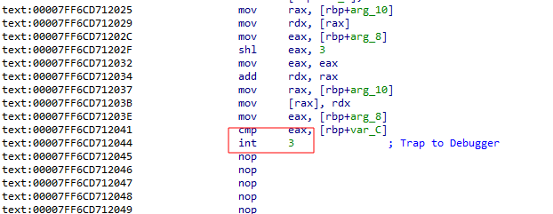
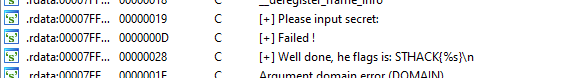
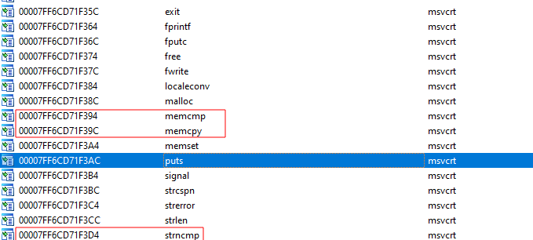
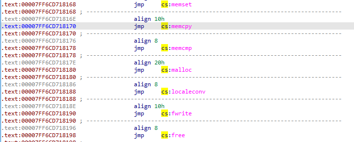
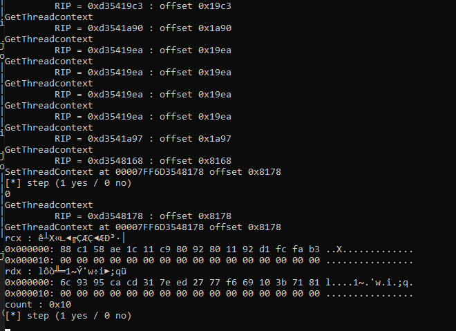
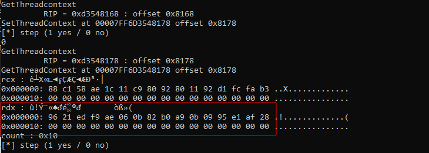
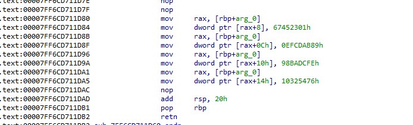
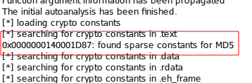

+++
author = "t0muxx"
categories = ["Writeup", "Reverse"]
date = "2024-02-03T00:00:00Z"
tags = ["Windows", "Reverse"]
title = "WU - Sthack 2021 - Reverse - Miteenpullover"
draft = true
+++

(This is a reupload of a writeup that was previously on the blog of a compagny that is closed now.)

How to defeat nanomite packer with dll injection and winapi functions hooking

## Intro

During the [sthack 2021](https://sthack.fr/) (ctf event @bordeaux france), [Phenol](https://twitter.com/Phenol__) created a reverse challenge that was unsolved (if i remember correctly).
As he told me it was really hard to solve it motivated me to do it.
I could not solve it during the CTF time but the next day i decided to continue to solve with a clear head.
I tought it will be cool to share my write-up as nobody solved this crack-me.


### Nanomite 101

- I knew that the crackme was using `nanomite` by the name and as [Phenol](https://twitter.com/Phenol__) published two challenge using this technology on [root-me.org](https://www.root-me.org/)
- The thing i know is that there is a father process that will bebug a child process and set it's register using system function to manipulate the child's control flow probably using `WaitForDebugEvent/GetThreadContext/SetThreadContext` etc...

- More info [here](https://www.apriorit.com/white-papers/293-nanomite-technology)

## First info

- The file is a `PE32+` executable.
```
file miteenpullover.exe
miteenpullover.exe: PE32+ executable (console) x86-64 (stripped to external PDB), for MS Windows
```

- It asks for a password :
```
[+] Please input secret:
AAAAA
[+] Failed !
```

### Analyzing binary with IDA-Pro

- The main detected by IDA is the loader.
- The real main is located at : `0x1400016F0`.
- When we look at the import section we see no `winapi` imports
        + Strange for a binary that should debug a child process.
        + It's probably doing dynamic API resolution.
        + When we check's xrefs for `GetProcAddress` we see only three call for `memcpy_s` and `__register_frame_info`, `__deregister_frame_info`
                * It's not using GetProcAddress to retrieve winapi functions addresses.

### Understanding function address retrieving

- The first interesting function is the function called at : `0x140001707`
- This function retrieve the PEB and store it's address into .bss global variable.

```cpp

__int64 my_Main()
{
  _QWORD *v1; // [rsp+28h] [rbp-18h]
  __int64 v2; // [rsp+30h] [rbp-10h]
  wchar_t *ExePath; // [rsp+38h] [rbp-8h]

  sub_140009600();
  my_RetrievePEB(&currentPEB);

  
}

PVOID *__fastcall my_RetrievePEB(PVOID *PEB)
{
  PVOID *result; // rax

  if ( PEB )
  {
    result = PEB;
    *PEB = NtCurrentPeb(); // ReadPEB
  }
  return result;

```

- If we take a look at the function called after (located at : `0x140001686`) there is a `call    r9`.
- Let's break on this instruction with `winDBG`
```
0:000> bp miteenpullover+1686
*** WARNING: Unable to verify timestamp for C:\Users\t0mux\Desktop\miteenpullover.exe
0:000> g
Breakpoint 0 hit
miteenpullover+0x1686:
00007ff7`35e91686 41ffd1          call    r9 {KERNEL32!GetModuleFileNameWStub (00007ffb`08b5df20)}

```
- Ok so it's calling `GetModuleFileWName` and the code located before should indicated the function that do the address resolution.
```cpp
wchar_t *sub_140001630()
{
  int v1; // eax
  wchar_t Source[260]; // [rsp+20h] [rbp-60h] BYREF
  wchar_t *Destination; // [rsp+228h] [rbp+1A8h]
  __int64 v4; // [rsp+230h] [rbp+1B0h]
  __int64 (__fastcall *v5)(_QWORD, wchar_t *, __int64); // [rsp+238h] [rbp+1B8h]

 v5 = (__int64 (__fastcall *)(_QWORD, wchar_t *, __int64))my_getFuncAddress(&dword_14000B040[64]);// function used to retrieve function address !
  if ( !v5 )
    return 0i64;
```

- Let's dive into this function (located at 0x140002063)
```cpp
__int64 __fastcall my_getFuncAddress(int *offset)
{
  int v1; // ebx

  if ( *((_QWORD *)&dataVariable + 2 * *offset + 1) )
  {
    if ( *((_QWORD *)offset + 1) )
    {
      return *((_QWORD *)offset + 1);
    }
    else
    {
      *((_QWORD *)offset + 1) = my_unknown1(*((_QWORD *)&dataVariable + 2 * *offset + 1), (unsigned int)offset[1]);
      if ( *((_QWORD *)offset + 1) )
        return *((_QWORD *)offset + 1);
      else
        return 0i64;
    }
  }
  else
  {
    v1 = *offset;
    *((_QWORD *)&dataVariable + 2 * v1 + 1) = my_unkown_with_PEB(
                                                (__int64)currentPEB,
                                                (wchar_t *)*((unsigned int *)&dataVariable + 4 * *offset)); // passing PEB to this one
    if ( *((_QWORD *)&dataVariable + 2 * v1 + 1) )
    {
      *((_QWORD *)offset + 1) = my_unknown1(*((_QWORD *)&dataVariable + 2 * *offset + 1), (unsigned int)offset[1]);
      if ( *((_QWORD *)offset + 1) )
        return *((_QWORD *)offset + 1);
      else
        return 0i64;
    }
    else
    {
      return 0i64;
    }
  }
}
```
- We see two interesting thing : 
        + It uses a global variable in `.data` (0x14000B020)
        + It passes the PEB to the second function called.

- As i'm  a bit lazy to fully understand all that pointer aritemtic shit, i will check the memory of the .data variable before i have to input my password. It should probably be initialized.

```
0:003> g
(96c.ce0): Break instruction exception - code 80000003 (first chance)
ntdll!DbgBreakPoint:
00007ffb`098f0860 cc              int     3
0:001> dq miteenpullover+B020
00007ff7`35e9b020  00000000`9528f42e 00007ffb`08b40000
00007ff7`35e9b030  00000000`e5c32db0 00007ffb`09850000
00007ff7`35e9b040  705d41ee`00000000 00007ffb`08b5cb60
00007ff7`35e9b050  056e2847`00000001 00007ffb`098ed080
00007ff7`35e9b060  5b4989b6`00000000 00007ffb`08b5c4f0
00007ff7`35e9b070  522d998b`00000001 00007ffb`098ed2a0
00007ff7`35e9b080  d2e5a960`00000000 00007ffb`08b60230
00007ff7`35e9b090  3cfcbee0`00000000 00007ffb`08b5b360
```
- it seems that all the second qword contains addresses.
- The two first correspond to base address of 
  - kernel32.dll
  - ntdll.dll
  
- The next are function pointers. 
- Great we know that it will store function pointers in this array.

- Looking in the function that receive the PEB is also interisting : 
```cpp
_LIST_ENTRY *__fastcall my_GetDllBaseAddress(_PEB *PEB, wchar_t *hashValue)
{
  unsigned __int16 *v2; // rax
  _LIST_ENTRY *Blink; // [rsp+30h] [rbp-10h]
  _LIST_ENTRY *inMemoryORderModuleList; // [rsp+38h] [rbp-8h]

  if ( PEB && hashValue )
  {
    inMemoryORderModuleList = PEB->Ldr->InMemoryOrderModuleList.Flink;
    Blink = inMemoryORderModuleList->Blink;
    while ( Blink != inMemoryORderModuleList )
    {
      v2 = wcslwr((wchar_t *)inMemoryORderModuleList[5].Flink);
      if ( hashValue == (wchar_t *)(unsigned int)my_hash_maybe(v2) )
        return inMemoryORderModuleList[2].Flink;
      inMemoryORderModuleList = inMemoryORderModuleList->Flink;
    }
  }
  return 0i64;
}
```

- By setting the good type on the first argument we understand that it will enumerate loaded module by using `PEB->Ldr->InMemoryOrderModuleList`
- I knew this technique as i implemented [Hell's Gate](https://github.com/vxunderground/VXUG-Papers/tree/main/Hells%20Gate) few days before
- `if ( hashValue == (wchar_t *)(unsigned int)my_hash_maybe(v2) )` This if show us that it's compare something with an "==" operator. The function called is an hash function !
```cpp
unsigned __int64 __fastcall my_hash_maybe(unsigned __int16 *a1)
{
  unsigned __int16 *v1; // rax
  unsigned __int64 v3; // [rsp+8h] [rbp-8h]

  v3 = 0i64;
  while ( *a1 )
  {
    v1 = a1++;
    v3 = *v1 ^ (16777619 * v3);
  }
  return v3;
}
```

- Same kind of compare is also in the first function called in `0x140002063`

```cpp
__int64 __fastcall my_unknown1(__int64 a1, __int64 hashedString)
{
  __int64 v3; // [rsp+20h] [rbp-30h]
  __int64 v4; // [rsp+28h] [rbp-28h]
  __int64 v5; // [rsp+30h] [rbp-20h]
  _DWORD *v6; // [rsp+38h] [rbp-18h]
  unsigned int i; // [rsp+4Ch] [rbp-4h]

  v6 = (_DWORD *)(*(unsigned int *)(*(int *)(a1 + 60) + a1 + 136) + a1);
  v5 = (unsigned int)v6[7] + a1;
  v4 = (unsigned int)v6[8] + a1;
  v3 = (unsigned int)v6[9] + a1;
  for ( i = 0; i < v6[6]; ++i )
  {
    if ( hashedString == (unsigned int)my_hash_char((char *)(*(unsigned int *)(4i64 * i + v4) + a1)) )
      return *(unsigned int *)(4i64 * *(unsigned __int16 *)(2i64 * i + v3) + v5) + a1;
  }
  return 0i64;
}

unsigned __int64 __fastcall my_hash_char(char *a1)
{
  char *v1; // rax
  unsigned __int64 v3; // [rsp+8h] [rbp-8h]

  v3 = 0i64;
  while ( *a1 )
  {
    v1 = a1++;
    v3 = *v1 ^ (16777619 * v3);
  }
  return v3;
}

```

- For a summary we know 
- It uses `PEB->Ldr->InMemoryOrderModuleList` to retrieve base address of loaded module.
- Hashing function on string to hide them.

## Resource Extraction and child finding

- The next called function is a function that take 0x309 (777) in first argument
```
unk_1400130A8 = sub_140002E3C(0x309u);
```
- This function calls another function that is interesting : 
```cpp
__int64 __fastcall sub_140002E3C(unsigned __int16 int777)
{
  __int64 v2; // [rsp+28h] [rbp-8h]

  v2 = sub_1400021D0(int777); // interesting
  if ( v2 )
    return v2;
  else
    return 0i64;
}

lcoated 0x1400021D0
```

- By breaking on the first dinamic call of this one we see that it's calling `FindResourceWStub` 
- The PE is containing resources !
```
0:000> g
Breakpoint 0 hit
miteenpullover+0x221c:
00007ff7`35e9221c ffd0            call    rax {KERNEL32!FindResourceWStub (00007ffb`08b60230)}

```

```cpp
__int64 __fastcall sub_1400021D0(unsigned __int16 int777)
{
  _DWORD Size[4]; // [rsp+2Ch] [rbp-44h] BYREF
  int v3; // [rsp+3Ch] [rbp-34h]
  _DWORD *v4; // [rsp+40h] [rbp-30h]
  __int64 (__fastcall *v5)(__int64); // [rsp+48h] [rbp-28h]
  __int64 v6; // [rsp+50h] [rbp-20h]
  __int64 (__fastcall *FuncAddress)(_QWORD, __int64); // [rsp+58h] [rbp-18h]
  __int64 v8; // [rsp+60h] [rbp-10h]
  __int64 (__fastcall *FindResourceWStub)(_QWORD, _QWORD, __int64); // [rsp+68h] [rbp-8h]

  FindResourceWStub = (__int64 (__fastcall *)(_QWORD, _QWORD, __int64))my_getFuncAddress(&dword_14000B040[16]);// FindResourceWStub
  if ( !FindResourceWStub )
    return 0i64;
  v8 = FindResourceWStub(0i64, int777, 10i64);
```

- Let's confirm that by using `peres` :
```
Save On:                         resources/rcdatas/777.rc
Save On:                         resources/rcdatas/999.rc
Save On:                         resources/groupicons/472.ico
```

- We have 3 ressources and their name gives us a hint (remember the 777 passed to the function)
- We extract them with `peres -x miteenpullover.exe`
- We can now analyze them
```
file resources/rcdatas/777.rc
resources/rcdatas/777.rc: data
binwalk resources/rcdatas/777.rc

DECIMAL       HEXADECIMAL     DESCRIPTION
--------------------------------------------------------------------------------
16            0x10            Zlib compressed data, default compression
 binwalk resources/rcdatas/999.rc 

DECIMAL       HEXADECIMAL     DESCRIPTION
--------------------------------------------------------------------------------
16            0x10            Zlib compressed data, default compression
xxd -e resources/groupicons/472.ico 
00000000: 00010000 80800005 00010000 08280020  ............ .(.
00000010: 00010001 00003030 00200001 000025a8  ....00.... ..%..
00000020: 20200002 00010000 10a80020 00030000  ..  .... .......
00000030: 00001818 00200001 00000988 10100004  ...... .........
00000040: 00010000 04680020 00050000           .... .h.....
```

- Two contains zlib compressed data, we extract them using `binwalk -x`
```
zlib-flate -uncompress < resources/rcdatas/_777.rc.extracted/10.zlib > /tmp/777.rc_out 
zlib-flate -uncompress < resources/rcdatas/_999.rc.extracted/10.zlib > /tmp/999.rc_out
file /tmp/777.rc_out
/tmp/777.rc_out: data
 xxd -e /tmp/777.rc_out | head
00000000: 00001000 00000000 0000000b 00000000  ................
00000010: 00002007 00000000 00001000 00000000  . ..............
00000020: 00000008 00000000 000069c4 00000000  .........i......
00000030: 00001000 00000000 00000004 00000000  ................
00000040: 00005b47 00000000 00001000 00000000  G[..............
00000050: 0000000b 00000000 00004f83 00000000  .........O......
00000060: 00001000 00000000 0000000b 00000000  ................
00000070: 00007924 00000000 00001000 00000000  $y..............
00000080: 00000005 00000000 00003dd4 00000000  .........=......
00000090: 00001000 00000000 00000008 00000000  ................
file /tmp/999.rc_out
/tmp/999.rc_out: PE32+ executable (console) x86-64 (stripped to external PDB), for MS Windows
```
- The 777 seems to contains int (offset ?)
- The 999 is a `PE32+` file
- By opening it in IDA we can comfirm that it's the child PE.



- It contains `int 3` instruction that the father will intercept !

## Father / Child relationship

- By looking at the strings contained in the child pe i can see interestings one : 



- Also the imports are interesting : 



- I checks xrefs to these imports and : 



- Something I can deduce it that the father will set the RIP of the child to some of theses addresse when it want it to call a function !

### Other interesting functions

- the function located at `0x14000199F` is some sort of process hollowing (it's calling `NtUnmapViewOfSection` / `VirtualAllocEx` / `ReadProcessMemory` / `WriteProcessMemory`) probably to hide the loading of the child process.
- The function located at `0x140002C91` is the main debugger loop : 

```cpp
__int64 __fastcall sub_140002C91(__int64 a1, __int64 a2)
...
  while ( v9 )                                  // While(true)
  {
    v5(v3, 0xFFFFFFFFi64);                      // WaitForDebugEvent
    if ( v3[0] == 1 )                           // EXCEPTION_DEBUG_EVENT
    {
      if ( v3[4] == -2147483645 )
      {
        my_handleDebug((_QWORD *)a1, a2);
        v8 = 65538i64;
      }
      else
      {
        v8 = 2147549185i64;
      }
    }
    else if ( v3[0] == 5 )                      // EXIT_PROCESS_DEBUG_EVENT
    {
      v9 = 0;
    }
    v4((unsigned int)v3[1], (unsigned int)v3[2], v8);
  }
```

- The function `0x1400027A0` contains the logic to control the child process by setting RIP : 
        + Headache because too much condition :D let's do simpler.

```cpp
__int64 __fastcall my_handleDebug(_QWORD *a1, __int64 a2)
{
  DWORD64 v3; // [rsp+30h] [rbp-30h] BYREF
  void (__fastcall *v4)(_QWORD, DWORD64, DWORD64 *, __int64, _QWORD); // [rsp+38h] [rbp-28h]
  unsigned int (__fastcall *v5)(_QWORD, LPCONTEXT); // [rsp+40h] [rbp-20h]
  unsigned int (__fastcall *FuncAddress)(_QWORD, LPCONTEXT); // [rsp+48h] [rbp-18h]
  LPCONTEXT Block; // [rsp+50h] [rbp-10h]
  _QWORD *v8; // [rsp+58h] [rbp-8h]

  v8 = (_QWORD *)unk_1400130A8;
  Block = (LPCONTEXT)malloc(0x4D0ui64);
  if ( !Block )
    return 0i64;
  Block->ContextFlags = 1048587;
  FuncAddress = (unsigned int (__fastcall *)(_QWORD, LPCONTEXT))my_getFuncAddress(&dword_14000B040[40]);
  if ( !FuncAddress )
    return 0i64;
  v5 = (unsigned int (__fastcall *)(_QWORD, LPCONTEXT))my_getFuncAddress(&dword_14000B040[44]);
  if ( !v5 )
    return 0i64;
  if ( !FuncAddress(a1[1], Block) )             // GetThreadContext
    return 0i64;
  while ( *v8 )
  {
    if ( *v8 == Block->Rip - a2 - 1 )
    {
      if ( v8[1] == 1i64 && (Block->EFlags & 0x40) != 0 )
      {
        Block->Rip = a2 + v8[2];
      }
      else if ( v8[1] != 2i64 || (Block->EFlags & 0x40) != 0 )
      {
        if ( v8[1] == 3i64 )
        {
          Block->Rip = a2 + v8[2];
        }
        else if ( v8[1] != 4i64 || (Block->EFlags & 0x880) != 0 || (Block->EFlags & 0x40) != 0 )
        {
          if ( v8[1] == 5i64 && ((Block->EFlags & 0x880) == 0 || (Block->EFlags & 0x40) != 0) )
          {
            Block->Rip = a2 + v8[2];
          }
          else if ( v8[1] != 6i64 || (Block->EFlags & 1) != 0 || (Block->EFlags & 0x40) != 0 )
          {
            if ( v8[1] == 7i64 && ((Block->EFlags & 1) == 0 || (Block->EFlags & 0x40) != 0) )
            {
              Block->Rip = a2 + v8[2];
            }
            else if ( v8[1] == 8i64 && (Block->EFlags & 0x880) != 0 )
            {
              Block->Rip = a2 + v8[2];
            }
            else if ( v8[1] == 9i64 && ((Block->EFlags & 0x880) != 0 || (Block->EFlags & 0x40) != 0) )
            {
              Block->Rip = a2 + v8[2];
            }
            else if ( v8[1] == 10i64 && (Block->EFlags & 1) != 0 )
            {
              Block->Rip = a2 + v8[2];
            }
            else if ( v8[1] == 11i64 && ((Block->EFlags & 1) != 0 || (Block->EFlags & 0x40) != 0) )
            {
              Block->Rip = a2 + v8[2];
            }
            else if ( v8[1] == 12i64 )
            {
              v3 = Block->Rip + 4;
              v4 = (void (__fastcall *)(_QWORD, DWORD64, DWORD64 *, __int64, _QWORD))my_getFuncAddress(&dword_14000B040[36]);
              if ( !v4 )
                return 0i64;
              Block->Rsp -= 8i64;
              v4(*a1, Block->Rsp, &v3, 8i64, 0i64);// WriteProcessMemory
              Block->Rip = a2 + v8[2];
            }
          }
          else
          {
            Block->Rip = a2 + v8[2];
          }
        }
        else
        {
          Block->Rip = a2 + v8[2];
        }
      }
      else
      {
        Block->Rip = a2 + v8[2];
      }
      break;
    }
    v8 += 3;
  }
  if ( !v5(a1[1], Block) )                      // SetThreadContext
    return 0i64;
  free(Block);
  return 1i64;
}
```

## Dll injection and Windows API hooking

- I know that the father will retrieve and set the child RIP register by using `GetThreadContext`/`SetThreadContex`. 
- I knew some offset in the child are used to call some functions 
        - Example baseAddress+0x8170 correspondt to memcpy call by the child process.


- My goal is :
        + Inject a dll into the parent process
        + The dll create hooks on `GetThreadContext`/`SetThreadContext`
        + Analyze whenever i'm on an interesing offset (cf function call.)

### Preparing the Dll

- I created a new Dll project with visual studio.

### Building minhook

- I lost a lot of time to correctly setup `minhook` during the CTF. So i'll write this down in case some people are noob like me :)
- `git clone https://github.com/TsudaKageyu/minhook.git`
- `cd minhook`
- `cmake .`
- Open `minhook.sln` into visual studio
- Select `Release` and `x64`
- Build
- it should have create a static library file in `\minhook\Release\minhook.x64.lib`
- I copy it over inside the directory where my dll sources are.
- I Copy also `.\minhook\include\MinHook.h`
- Now i can use `minhook` in my dll

### Dll injector :

- I will not cover the creation of the dll injector because there are plenty of infos on the web.
- But i used a tricks to be sure that the Dll is loaded before the process starts.
        + I started the process with `CREATE_SUSPENDED` flag, then i injected the Dll into, then i used `ResumeThread`.

### Dll code

- I wil not give a full explanation on the code but here is the DllMain :

```cpp
BOOL APIENTRY DllMain( HMODULE hModule,
                       DWORD  ul_reason_for_call,
                       LPVOID lpReserved
                     )
{
    switch (ul_reason_for_call)
    {
    case DLL_PROCESS_ATTACH:
    {
        imageBase = getImageBase(); // Read PEB to get current process base's address
        SetHook(); // Set the hook using MinHook.
        break;
    }
    case DLL_THREAD_ATTACH:
    case DLL_THREAD_DETACH:
    case DLL_PROCESS_DETACH:
        break;
    }
    return TRUE;
}
```

- Here the code of my handler for GetThreadContext : 
```cpp

int offset[] = {0x8170, 0x8178 , 0x8138, 0};

int isOffset(int offs)
{
    int i = 0;

    while (offset[i] != 0)
    {
        if (offset[i] == offs)
            return (1);
        i++;
    }
    return (0);

}

BOOL WINAPI handler_getThreadContext(HANDLE hThread, const CONTEXT * lpContext)
{
    int d = 0;
    int offs = 0;

   printf("GetThreadcontext\n");
   printf("\t RIP = %#x : offset %#x\n", lpContext->Rip, lpContext->Rip - (INT64)imageBase);
    offs = lpContext->Rip - (INT64)imageBase;
    if (isOffset(offs))
    {
        printf("GetThreadContext at %p offset %#x\n",lpContext->Rip, offs);
        if (offs == 0x8178) // MemCmp
        {
            char buffer[0x10];
            ReadProcessMemory(hChild, (LPVOID)lpContext->Rcx, buffer, 0x20, NULL);
            printf("rcx : %s\n", buffer);
            hexdump(buffer, 0x20);
            ReadProcessMemory(hChild, (LPVOID)lpContext->Rdx, buffer, 0x20, NULL);
            printf("rdx : %s\n", buffer);
            hexdump(buffer, 0x20);
            printf("count : %#x\n", lpContext->R8);

        }
        printf("[*] step (1 yes / 0 no)\n");
        scanf("%d", &step); // If set to one it will stop on each GetThreadContext call 
    }
    if (step == 1)
    {
        scanf("%d", &d);
    }
    return (fpGetThreadContext(hThread, lpContext)); // Calling original GetThreadContext
}
```

- The code is basically the same for `SetThreadContext` handler.
- What i do here is that i check if child's `RIP - BaseAddress` == an offset used to call a function in the child process.
        + Remember : 
        + 
        + If `RIP - BaseAddress == 0x8170` the child will call `memcpy`.

- If i'm on an interesting read registers and the memory of the child process to have arguments value.
- I retrieved an handle to the child process by hooking `CreateProcessW`

- When executing the process with the hooks on, we see that at one moment memcmp is called : 



- This is a good way. By changing our input we see that rdx changes, but not rcx : 



- Let's try to understand how is built `rcx` !
- By analyzing offset processed before the `memcmp` and analyzing the child PE i found something that i though was "crypto" related : 




- So i tried to use [findcrypt](https://github.com/you0708/ida/tree/master/idapython_tools/findcrypt) on the child PE : 



- W00t! the value in rcx is probably a md5 hash !
- Let's extract it : `88c158ae1c11c98092801192d1fcfab3` == `SuperHeroes`


- Nice, what a long way ! :)


### Dll complete code :

```cpp
#pragma warning(disable:4996)
#define _CRT_SECURE_NO_WARNINGS

#include "Header.h"
#if defined _M_X64
#pragma comment(lib, "minHook.x64.lib")
#elif defined _M_IX86
#pragma comment(lib, "libMinHook.x86.lib")
#endif

#include "MinHook.h"
#ifndef HEXDUMP_COLS
#define HEXDUMP_COLS 16
#endif

void hexdump(void* mem, unsigned int len)
{
    unsigned int i, j;

    for (i = 0; i < len + ((len % HEXDUMP_COLS) ? (HEXDUMP_COLS - len % HEXDUMP_COLS) : 0); i++)
    {
        /* print offset */
        if (i % HEXDUMP_COLS == 0)
        {
            printf("0x%06x: ", i);
        }

        /* print hex data */
        if (i < len)
        {
            printf("%02x ", 0xFF & ((char*)mem)[i]);
        }
        else /* end of block, just aligning for ASCII dump */
        {
            printf("   ");
        }

        /* print ASCII dump */
        if (i % HEXDUMP_COLS == (HEXDUMP_COLS - 1))
        {
            for (j = i - (HEXDUMP_COLS - 1); j <= i; j++)
            {
                if (j >= len) /* end of block, not really printing */
                {
                    putchar(' ');
                }
                else if (isprint(((char*)mem)[j])) /* printable char */
                {
                    putchar(0xFF & ((char*)mem)[j]);
                }
                else /* other char */
                {
                    putchar('.');
                }
            }
            putchar('\n');
        }
    }
}

using namespace std;

//int offset[] = {0x226F, 0x22B0, 0x22FF, 0x2300, 0x2250, 0x22AC, 0x22C8, 0x2307, 0x2313,0x8178,0x2312, 0x2295, 0 };
// int offset[] = {0x224F, 0x2247, 0x2254, 0x2273, 0x226F, 0x2299, 0x22AC,0x2295, 0x2296, 0x2297, 0x2298, 0 };
int offset[] = {0x8170, 0x8178 , 0x8138, 0};

typedef DWORD(WINAPI* RESUMETHREAD)(HANDLE);
typedef BOOL (WINAPI* SETTHREADCONTEXT)(HANDLE, const CONTEXT *);
typedef BOOL (WINAPI* GETTHREADCONTEXT)(HANDLE, const CONTEXT *);
typedef BOOL (WINAPI* CREATEPROCESSW)(
    LPCWSTR               ,
    LPWSTR                ,
    LPSECURITY_ATTRIBUTES ,
    LPSECURITY_ATTRIBUTES ,
    BOOL                  ,
    DWORD                 ,
    LPVOID                ,
    LPCWSTR               ,
    LPSTARTUPINFOW        ,
    LPPROCESS_INFORMATION 
);
// Pointer for calling original MessageBoxW.
SETTHREADCONTEXT fpSetThreadContext = NULL;
GETTHREADCONTEXT fpGetThreadContext = NULL;
RESUMETHREAD fpResumeThread = NULL;
CREATEPROCESSW fpCreateProcessW = NULL;

FILE* file = NULL;
PVOID imageBase = NULL;
HANDLE hChild = 0;

int step = 0;

int isOffset(int offs)
{
    int i = 0;

    while (offset[i] != 0)
    {
        if (offset[i] == offs)
            return (1);
        i++;
    }
    return (0);

}

BOOL handler_createProcessW(
    LPCWSTR               lpApplicationName,
    LPWSTR                lpCommandLine,
    LPSECURITY_ATTRIBUTES lpProcessAttributes,
    LPSECURITY_ATTRIBUTES lpThreadAttributes,
    BOOL                  bInheritHandles,
    DWORD                 dwCreationFlags,
    LPVOID                lpEnvironment,
    LPCWSTR               lpCurrentDirectory,
    LPSTARTUPINFOW        lpStartupInfo,
    LPPROCESS_INFORMATION lpProcessInformation
)
{
    printf("CreateProcessW \n");
    printf("dwCreateion flag : %#x\n", dwCreationFlags);
    dwCreationFlags &= ~(CREATE_NO_WINDOW);
    printf("dwCreateion flag : %#x\n", dwCreationFlags);
    BOOL ret = fpCreateProcessW(lpApplicationName, lpCommandLine, lpProcessAttributes, lpThreadAttributes, bInheritHandles, dwCreationFlags, lpEnvironment, lpCurrentDirectory, lpStartupInfo, lpProcessInformation);
    printf("[*] childPID = %d\n", lpProcessInformation->dwProcessId);
    hChild = lpProcessInformation->hProcess;
    return (ret);
}

DWORD WINAPI handler_resumeThread(HANDLE hThread)
{
    
    return (fpResumeThread(hThread));
}

BOOL WINAPI handler_setThreadContext(HANDLE hThread, const CONTEXT* lpContext)
{
  //  printf("SetThreadContext\n");
    int offs = 0;
    int d = 0;
  //  printf("\t RIP = %#x : offset %#x\n", lpContext->Rip, lpContext->Rip - (INT64)imageBase);
    offs = lpContext->Rip - (INT64)imageBase;
    if (isOffset(offs))
    {
        printf("SetThreadContext at %p offset %#x\n", lpContext->Rip, offs);
        printf("[*] step (1 yes / 0 no)\n");
        scanf("%d", &step);
    }
    if (step == 1)
    {
        scanf("%d", &d);
    }
    return (fpSetThreadContext(hThread, lpContext));
}

BOOL WINAPI handler_getThreadContext(HANDLE hThread, const CONTEXT * lpContext)
{
    int d = 0;
    int offs = 0;

   printf("GetThreadcontext\n");
   printf("\t RIP = %#x : offset %#x\n", lpContext->Rip, lpContext->Rip - (INT64)imageBase);
    offs = lpContext->Rip - (INT64)imageBase;
    if (isOffset(offs))
    {
        printf("GetThreadContext at %p offset %#x\n",lpContext->Rip, offs);
        if (offs == 0x8178 || offs == 0x8138) // MemCmp || strncmp
        {
            char buffer[0x10];
            ReadProcessMemory(hChild, (LPVOID)lpContext->Rcx, buffer, 0x20, NULL);
            printf("rcx : %s\n", buffer);
            hexdump(buffer, 0x20);
            ReadProcessMemory(hChild, (LPVOID)lpContext->Rdx, buffer, 0x20, NULL);
            printf("rdx : %s\n", buffer);
            hexdump(buffer, 0x20);
            printf("count : %#x\n", lpContext->R8);

        }
        printf("[*] step (1 yes / 0 no)\n");
        scanf("%d", &step);
    }
    if (step == 1)
    {
        scanf("%d", &d);
    }
    return (fpGetThreadContext(hThread, lpContext));
}

PVOID getImageBase()
{
    _my_PEB *peb = (_my_PEB *)__readgsqword(0x60);
    return peb->ImageBase;

}

void SetHook()
{

    if (MH_Initialize() == MB_OK)
    {
        MH_CreateHook(&SetThreadContext, &handler_setThreadContext, reinterpret_cast<void**>(&fpSetThreadContext));
        MH_CreateHook(&GetThreadContext, &handler_getThreadContext, reinterpret_cast<void**>(&fpGetThreadContext));
        //MH_CreateHook(&ResumeThread, &handler_resumeThread, reinterpret_cast<void**>(&fpResumeThread));
        MH_CreateHook(&CreateProcessW, &handler_createProcessW, reinterpret_cast<void**>(&fpCreateProcessW));
        
        MH_EnableHook(&SetThreadContext);
        MH_EnableHook(&GetThreadContext);
        MH_EnableHook(&CreateProcessW);
    }
}

void UnHook()
{
    if (MH_DisableHook(&SetThreadContext) == MB_OK)
    {
    MessageBoxA(NULL, "test", "test", MB_OK);
        MH_Uninitialize();
    MessageBoxA(NULL, "test", "test", MB_OK);
    }
}
    

BOOL APIENTRY DllMain( HMODULE hModule,
                       DWORD  ul_reason_for_call,
                       LPVOID lpReserved
                     )
{
    switch (ul_reason_for_call)
    {
    case DLL_PROCESS_ATTACH:
    {
        imageBase = getImageBase(); // Read PEB to get current process base's address
        SetHook();
        break;
    }
    case DLL_THREAD_ATTACH:
    case DLL_THREAD_DETACH:
    case DLL_PROCESS_DETACH:
        //UnHook();
        break;
    }
    return TRUE;
}